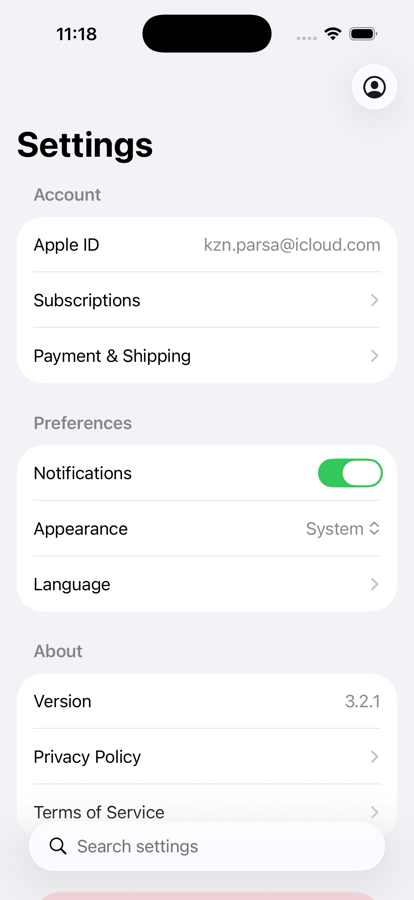
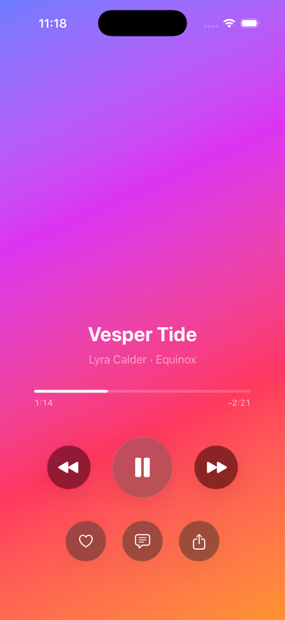
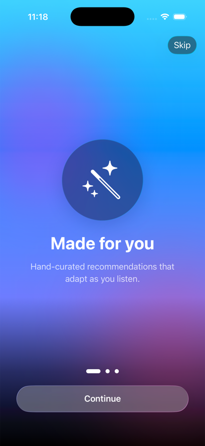
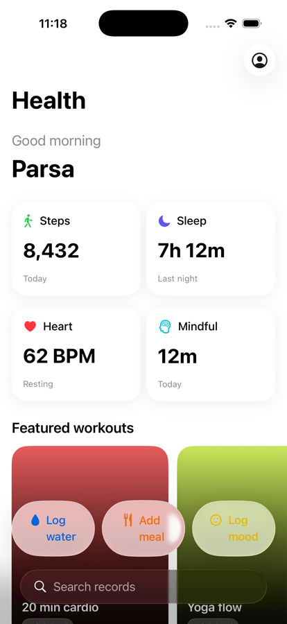
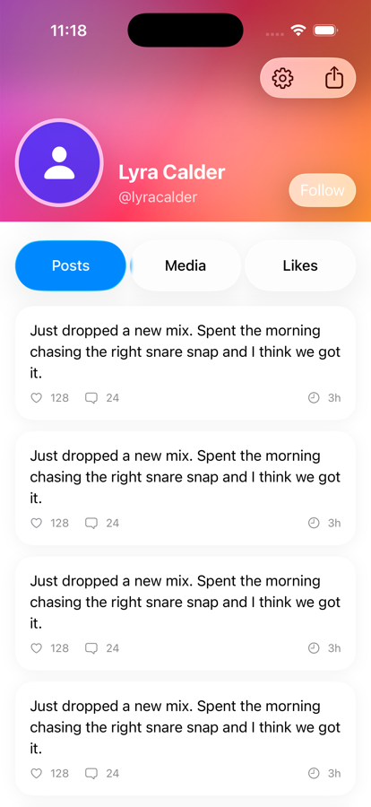
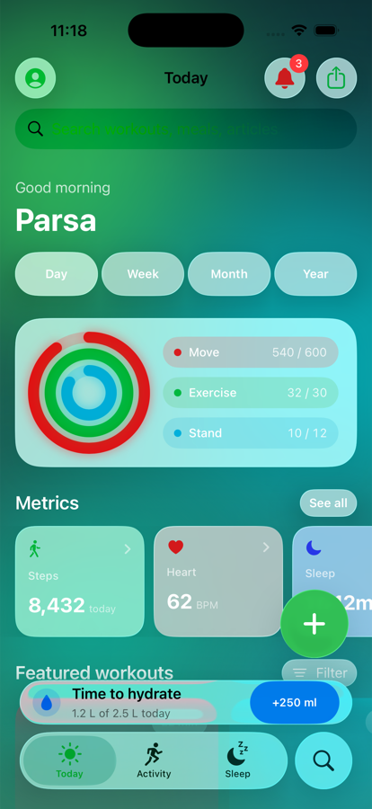

# liquid-glass

A Claude Code **plugin + skill** for building SwiftUI interfaces with Apple's **Liquid Glass** design on **iOS 26 and iOS 27** (also iPadOS, macOS, watchOS, and tvOS 26/27).

Every API in the skill has been checked against Apple's published documentation (October 2026, iOS 27 SDK). The skill also ships a linter that catches the mistakes models make most often with this API.

| | | |
|---|---|---|
|  |  |  |
| Settings: minimized search, glass toolbar | Music player: glass transport controls | Onboarding: glass over a live gradient |
|  |  |  |
| Dashboard: content cards, glass chrome | Profile: cover under the glass bar | Health: full TabView shell with action menu |

<sub>Screenshots were captured from version 1 on iPhone 17 Pro, iOS 26.3. Version 2.0 reworked several screens to follow Apple's guidance more closely (content cards no longer use glass; see the [CHANGELOG](CHANGELOG.md)), and fresh captures are pending. Run the screens yourself with the <a href="Gallery">Gallery app</a>: <code>cd Gallery && xcodegen generate && open Gallery.xcodeproj</code> (Xcode 27).</sub>

## What's inside

- **API reference.** Exact declarations for `glassEffect(_:in:)`, `Glass`, `GlassEffectContainer`, `glassEffectID`, `glassEffectUnion`, `glassEffectTransition`, the glass button styles, and concentric shapes (`ConcentricRectangle` + `containerShape`). It includes an availability matrix and a list of names that *don't* exist (`isEnabled:`, `.containerConcentric`, `toolbarMinimizeBehavior`, …).
- **System chrome.** Toolbars, navigation bars, tab bars, search, sheets, and scroll edge effects, with the iOS 26 APIs and the iOS 27 additions: `toolbarMinimizationBehavior`, `visibilityPriority`, `ToolbarOverflowMenu`, `.topBarPinnedTrailing`, `TabRole.prominent`, `NavigationTransition.crossFade`, `presentationPlacement`, and iPhone Duo's vertical bars. It also shows how to gate them on an iOS 26 target.
- **What's new in iOS 27.** The automatic material refinements, the Liquid Glass slider, the end of `UIDesignRequiresCompatibility`, behavior changes in the 27 SDK, and deprecations.
- **Migration guide.** Choosing a deployment target, availability gating, replacing deprecated calls, and supporting deployment targets below 26.
- **HIG principles.** Apple's rules in Apple's words: glass for the functional layer only, no glass on glass, regular vs clear (with dimming), tint for prominence, and brand color in the content layer.
- **Design tokens, motion, accessibility, performance.** Each value is labeled *Apple* or *suggested*. No invented performance numbers.
- **Anti-patterns.** 22 ❌/✅ pairs.
- **Patterns.** Navigation bar, tab bar, floating toolbar, card stack, sheet, search.
- **Ten full-screen examples.** Settings, Music Player, Onboarding, Photo Detail, Dashboard, Chat, Profile, Login, Health app shell, and an iOS 27 Store shell. Each marks its functional and content layers.
- **`check_glass.py` linter.** A standard-library Python script that flags invented APIs, glass on system chrome or content, ungated iOS 27 APIs, and calls deprecated in the 27 SDK.
- **Pre-ship checklist** with a symptom → fix table.

## Install as a plugin (recommended)

In Claude Code:

```
/plugin marketplace add https://github.com/heyparsadev/claude-plugins.git
/plugin install liquid-glass@parsa-plugins
```

After that, the skill activates whenever you ask for SwiftUI work that involves Liquid Glass or iOS 26/27 design.

> 💡 Use the full `https://...git` URL, not the `owner/repo` shorthand, so cloning uses HTTPS and needs no SSH key.

The plugin is also listed in the [Claude plugin directory](https://claude.ai/customize/plugins/id/b4df58c1-7a52-4173-87e0-b39edf51c636%40anthropic-plugin-directory).

To update later:
```
/plugin marketplace update parsa-plugins
```

To remove:
```
/plugin uninstall liquid-glass@parsa-plugins
```

The [claude-plugins](https://github.com/heyparsadev/claude-plugins) marketplace carries other plugins too. To install this one alone, use this repo directly:

```
/plugin marketplace add https://github.com/heyparsadev/liquid-glass-skill.git
/plugin install liquid-glass@liquid-glass
```

## Install as a bare skill (without the plugin system)

Symlink the inner skill folder:

```sh
git clone https://github.com/heyparsadev/liquid-glass-skill.git
ln -s "$(pwd)/liquid-glass-skill/skills/liquid-glass" ~/.claude/skills/liquid-glass
```

Or for a single project:
```sh
mkdir -p .claude/skills
ln -s /path/to/liquid-glass-skill/skills/liquid-glass .claude/skills/liquid-glass
```

## When it activates

Claude chooses the skill from its description. It activates when you:

- write or edit SwiftUI for iOS 26 or iOS 27, or the matching iPadOS, macOS, watchOS, or tvOS releases,
- mention Liquid Glass, `glassEffect`, `GlassEffectContainer`, glass buttons, iOS 26/27 design, Xcode 27, or WWDC25/WWDC26 design changes,
- ask to redesign, modernize, audit, or migrate a SwiftUI screen to the current system look.

## The linter

```sh
python3 skills/liquid-glass/scripts/check_glass.py <files-or-folders> --target 26.0
```

It is read-only and needs only the Python standard library. It reports `error` (won't compile or is wrong), `warn` (breaks a design rule), and `info` (needs a gate, or a migration is worth doing). It exits 1 on errors. Silence a line with `// check-glass: ignore` or `// check-glass: ignore=<rule-id>`. Tests: `python3 -m unittest discover -s tests`.

## Scope

- ✅ SwiftUI on iOS, iPadOS, Mac Catalyst, macOS, watchOS, and tvOS 26 and later
- ✅ iOS 27 APIs, with availability gating for apps that still target iOS 26
- ➖ Deployment targets below 26: covered briefly (gated helpers with a material fallback)
- ❌ visionOS (the `Glass` / `glassEffect` APIs aren't available there)
- ❌ UIKit / AppKit, React Native, Flutter

## Repository layout

```
.claude-plugin/
  plugin.json              ← plugin manifest
  marketplace.json         ← lets this repo serve as a marketplace too
skills/
  liquid-glass/
    SKILL.md               ← entry point: workflow, decision tree, golden rules, file index
    references/            ← 01 API · 02 HIG · 03 tokens · 04 motion · 05 accessibility ·
                             06 performance · 07 anti-patterns · 08 system chrome ·
                             09 what's new in iOS 27 · 10 migration
    patterns/              ← copy-paste recipes per surface
    examples/              ← ten full-screen SwiftUI examples
    checklists/            ← pre-ship review
    scripts/check_glass.py ← linter
Gallery/                   ← host app that runs the examples (XcodeGen)
tests/                     ← linter tests
docs/screenshots/          ← README images
docs/research/ios27/       ← raw research and verification notes behind the 2.0 rewrite
CHANGELOG.md
LICENSE
```

## How it was verified

- **API declarations and availability** come from Apple's DocC documentation. **Design rules** come from the HIG and WWDC25/WWDC26 sessions, quoted where stated. Each finding was checked by an independent second pass. The notes are in [docs/research/ios27](docs/research/ios27).
- **The examples** pass the linter with no errors or warnings. Build them with Xcode 27 through the Gallery app before relying on them.

## License

MIT. See [LICENSE](LICENSE). The documentation is derived from Apple's public developer documentation, Human Interface Guidelines, and WWDC25/WWDC26 sessions. The example code is original.
